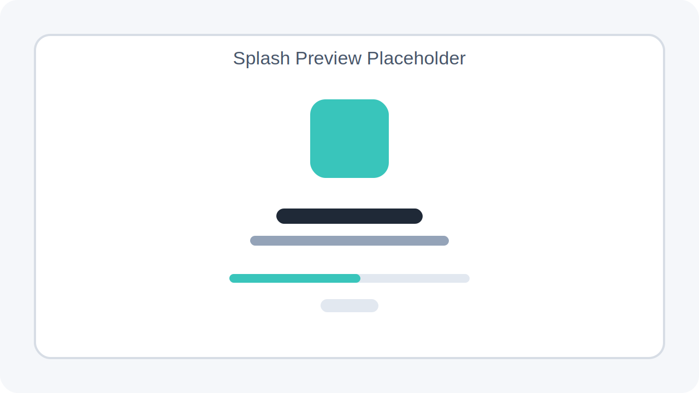
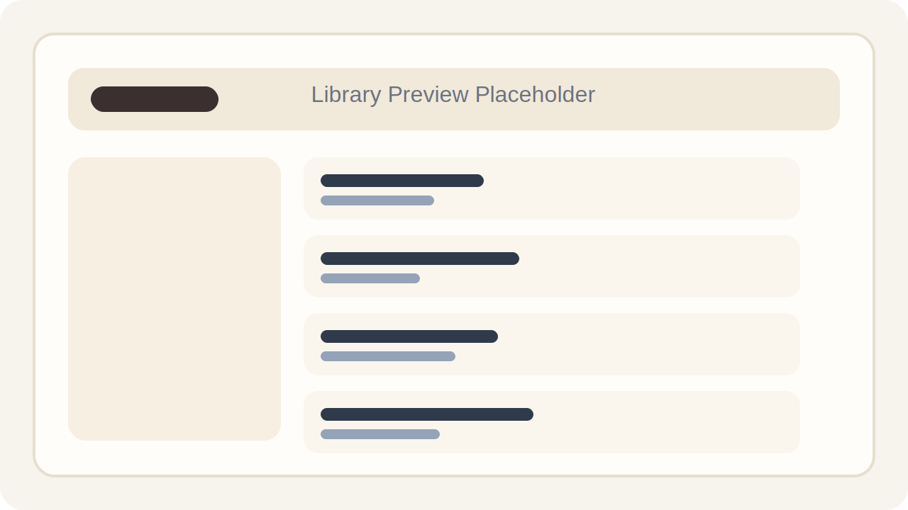
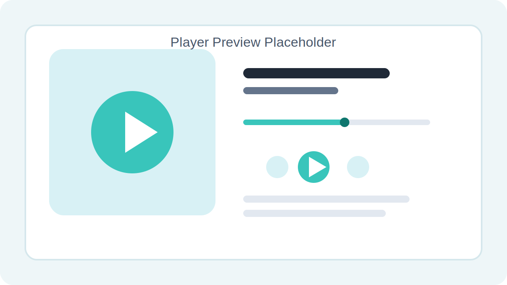
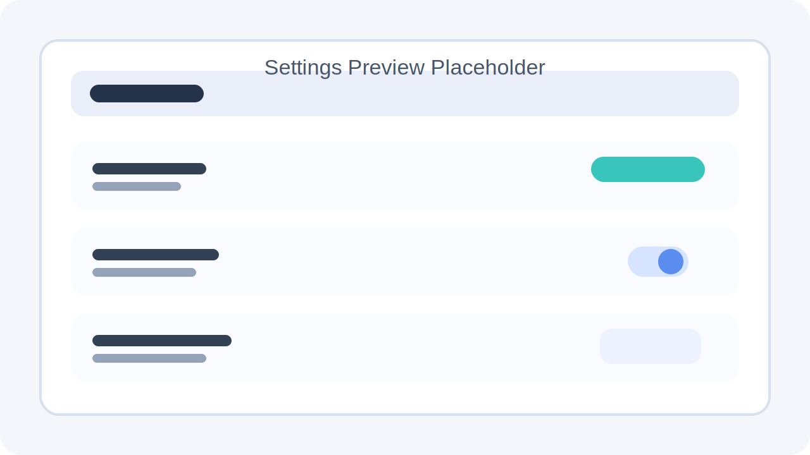

# M3Music

基于 Flutter 的跨平台本地音乐播放器项目，当前代码已实现启动初始化、本地音乐扫描、播放控制、主题切换、歌单/收藏/历史恢复，以及可选的登录注册接口对接。

## 项目概览

- 应用入口在 [lib/main.dart](/home/cangli/Desktop/dart/myapp/lib/main.dart)，启动时会先执行 `InitializationService.preRunInit()`，随后初始化 `audio_service` 后台播放服务。
- 全局状态通过 `provider` 管理，当前注册了 `ThemeProvider`、`MusicProvider`、`UserProvider`、`NavProvider`、`StartupProvider`。
- 路由由 [lib/router/IndexRouter/index.dart](/home/cangli/Desktop/dart/myapp/lib/router/IndexRouter/index.dart) 管理，默认从 `/splash` 进入。
- 这是一个“本地音乐优先”的播放器：音乐库数据主要来自本地目录扫描，而不是纯在线流媒体。

## 已和代码核对的功能

### 1. 启动与初始化

- 启动页位于 [lib/views/Splash/index.dart](/home/cangli/Desktop/dart/myapp/lib/views/Splash/index.dart)，会展示初始化进度和失败重试。
- 初始化流程由 [lib/providers/StartupProvider/index.dart](/home/cangli/Desktop/dart/myapp/lib/providers/StartupProvider/index.dart) 编排，分为 3 步：
  - 加载界面设置
  - 扫描本地音乐
  - 恢复播放器状态
- Android 首次启动会跳转到 [lib/views/SetupWizard/index.dart](/home/cangli/Desktop/dart/myapp/lib/views/SetupWizard/index.dart) 申请权限；非 Android 平台启动完成后直接进入首页。

### 2. 路由与界面结构

- 主导航包含 4 个一级页面：
  - `/home` 首页
  - `/music` 音乐库
  - `/dashboard` 仪表盘
  - `/user` 我的
- 附加页面包括：
  - `/settings` 设置
  - `/about` 关于
  - `/login` 登录/注册
  - `/music-detail` 播放详情
- 主界面在 [lib/views/index.dart](/home/cangli/Desktop/dart/myapp/lib/views/index.dart) 中根据宽度自适应：
  - `>= 450px` 使用侧边栏布局
  - `< 450px` 使用底部导航

### 3. 音乐播放与媒体库

- `MusicProvider` 位于 [lib/providers/MusicProvider/index.dart](/home/cangli/Desktop/dart/myapp/lib/providers/MusicProvider/index.dart)，负责：
  - 播放/暂停
  - 上一首/下一首
  - 音量持久化
  - 播放队列管理
  - 收藏与历史记录
  - 用户歌单恢复
  - 歌词解析结果缓存
  - 版本号读取
- 本地扫描逻辑位于 [lib/service/Music/index.dart](/home/cangli/Desktop/dart/myapp/lib/service/Music/index.dart)：
  - 递归扫描已保存目录
  - 通过 `mime` 判断音频文件
  - 使用 `metadata_god` 读取标题、歌手、专辑、时长和封面
  - 自动读取同名 `.lrc` 歌词文件
- 文件目录管理位于 [lib/service/Files/index.dart](/home/cangli/Desktop/dart/myapp/lib/service/Files/index.dart)，扫描目录会持久化到 `SharedPreferences`。

### 4. 主题与设置

- 主题状态位于 [lib/providers/ThemeProvider/index.dart](/home/cangli/Desktop/dart/myapp/lib/providers/ThemeProvider/index.dart)。
- 当前代码中可确认的设置项包括：
  - 主题模式
  - 主题种子色
  - 列表密度
  - 音质选项
  - 歌词页是否显示封面
  - 启动时自动播放
  - 通知栏详情显示
  - 双击列表项快速播放
  - 播放列表排序方式
  - 最大历史记录数量
- 设置持久化由 [lib/service/Settings/index.dart](/home/cangli/Desktop/dart/myapp/lib/service/Settings/index.dart) 完成。

### 5. 登录与后端接口

- 登录/注册页位于 [lib/views/Login/index.dart](/home/cangli/Desktop/dart/myapp/lib/views/Login/index.dart)。
- 认证接口封装位于 [lib/api/Client/Auth/index.dart](/home/cangli/Desktop/dart/myapp/lib/api/Client/Auth/index.dart)。
- 接口基地址来自 `.env` 中的 `API_URL`，读取逻辑位于 [lib/config/index.dart](/home/cangli/Desktop/dart/myapp/lib/config/index.dart)。
- 仓库中包含 `backend/` 目录和独立说明 [backend/README.md](/home/cangli/Desktop/dart/myapp/backend/README.md)，说明该项目支持前后端联调；但本地音乐扫描与本地播放能力本身不依赖后端。

## 预览图占位

当前仓库还没有统一维护的正式截图，这里先放入占位图，后续可以直接替换同名文件。

| 页面 | 占位图 |
| --- | --- |
| 启动页 |  |
| 音乐库 |  |
| 播放详情 |  |
| 设置页 |  |

## 目录结构

```text
lib/
├── main.dart
├── api/                 # 网络请求与数据模型
├── components/          # 通用组件与播放控制条
├── config/              # 环境配置读取
├── contants/            # 资源与主题常量
├── model/               # 本地业务模型
├── providers/           # 全局状态
├── router/              # go_router 路由配置
├── service/             # 初始化、设置、音频、文件等服务
└── views/               # 页面视图

backend/
└── ...                  # 可选后端服务
```

## 运行方式

### 环境要求

- Flutter SDK: `^3.11.4`
- Dart SDK: `^3.11.4`

### 安装依赖

```bash
flutter pub get
```

### 配置 `.env`

在项目根目录创建 `.env`，至少包含：

```env
API_URL=http://127.0.0.1:8080
```

如果你暂时不联调后端，也可以保留空值，启动初始化阶段会继续执行。

### 启动应用

```bash
flutter run
```

常见目标平台说明：

- Android：支持首次启动权限引导与本地媒体扫描
- Linux / Windows：已包含桌面窗口初始化与本地扫描逻辑
- iOS：工程存在，但本 README 未额外声明已验证的本地权限流程
- macOS：工程存在，窗口管理已接入，但音频链路未在文档中视为已验证

## 文档核对结论

这份 README 已按当前仓库代码重新整理，并刻意移除了以下不适合继续直接宣称的内容：

- 没有再写死“功能全部完成”或“代码质量指标”这类容易过时的数据
- 没有把 Web 平台列为当前文档中的主支持目标
- 没有把后端登录能力描述成应用运行的前置条件
- 没有把未在代码中稳定体现的功能写成既成事实

## 补充文档

- [docs/m3-color-guidelines.md](/home/cangli/Desktop/dart/myapp/docs/m3-color-guidelines.md)
- [docs/shared-components.md](/home/cangli/Desktop/dart/myapp/docs/shared-components.md)
